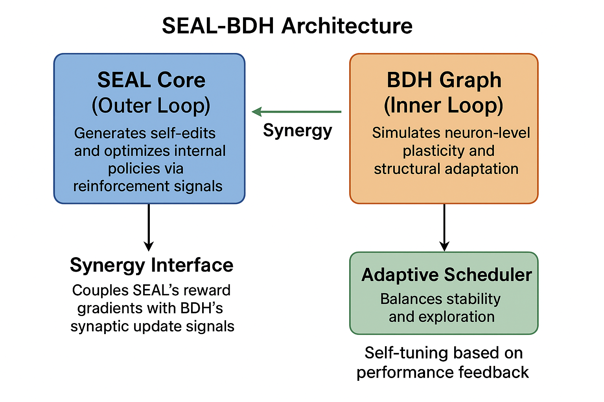

**SEAL-BDH Hybrid Architecture Simulation** — fully aligned with the **Apache License 2.0**, research intent, and upcoming public release.

---

# 🧬 SEAL–BDH Hybrid Architecture: Synergistic Emergent Adaptive Learning

**Version:** 1.0
**License:** [Apache License 2.0](./LICENSE)
**Author:** [Sriram Dayal](mailto:sriramdayal279@gmail.com)
**Project Type:** Research Simulation – Adaptive AI Framework Prototype

---

## 🌍 Overview

**SEAL–BDH** (Self–Evolving Adaptive Learning × Bio–inspired Dragon Hatchling) is a hybrid simulation exploring how **adaptive self-improvement** and **biologically inspired neural dynamics** can coexist within one unified system.

This project models the *synergy between reinforcement-driven adaptation (SEAL)* and *graph-based Hebbian emergence (BDH)* — showing how such interaction can lead to stable, self-regulating, and efficient learning.

> 🧩 **Core Idea:**
> A self-editing reinforcement learner (SEAL) dynamically co-adapts with a large-scale neural graph (BDH), producing emergent behaviors like modularity, sparsity control, and adaptive learning-rate regulation.

---

## 🧠 Conceptual Architecture

### **SEAL: Self-Adapting LLM Framework**

* Reinforcement learning loop that improves via self-generated “edits.”
* Learns from reward deltas (ΔR) between iterations.
* Implements **inner-loop** (self-edit refinement) and **outer-loop** (policy update).

### **BDH: Biologically-inspired Dragon Hatchling Graph**

* 32,768 neurons connected via dynamic synaptic edges.
* Follows **Hebbian plasticity**:

  > “Neurons that fire together, wire together.”
* Exhibits emergent **sparsity (~20%)**, **community modularity**, and **scale-free topology**.
* Maintains a **synaptic attention state matrix (σ)** enabling adaptive weighting.

### **Hybrid Coupling Mechanism**

* SEAL’s reinforcement signal modulates BDH’s synaptic updates.
* BDH’s structural dynamics reshape SEAL’s edit quality through a **synergy factor (ϕ)**.
* The hybrid learning rate evolves as:
  ηhybrid​=η0​×(1+α⋅ϕ)
  
ηhybrid → the effective adaptive learning rate

𝜂0→ the base learning rate

𝛼→ synergy scaling coefficient

𝜙→ synergy factor, derived from
* This coupling stabilizes the learning process while promoting emergent efficiency.

---

## 🧩 Simulation Methodology

* **Iterations:** 60 (conceptual cycles)
* **Neurons:** 32,768 (graph nodes)
* **Active fraction:** 20–27%
* **Learning:** Reinforcement-guided Hebbian adaptation
* **Metrics observed:**

  * Component quality (SEAL + BDH)
  * Synergy coefficient (ϕ)
  * Adaptive learning rate (η)
  * Graph modularity and sparsity
  * Reward evolution and stability
---


## 🧩 Model Architecture

The **SEAL-BDH Hybrid Architecture** integrates two synergistic systems — a **Self-Adapting Reinforcement Module (SEAL)** and a **Biological Dynamics Graph (BDH)** — connected through a co-adaptive control loop.

> This design models how *adaptive self-edit generation* and *Hebbian plasticity* can interact to produce emergent self-improvement in artificial systems.

| Component                  | Role                                                                            | Key Mechanism                                |
| -------------------------- | ------------------------------------------------------------------------------- | -------------------------------------------- |
| **SEAL Core (Outer Loop)** | Generates self-edits and optimizes internal policies via reinforcement signals. | Reinforcement-guided self-improvement        |
| **BDH Graph (Inner Loop)** | Simulates neuron-level plasticity and structural adaptation.                    | Hebbian learning and modular graph evolution |
| **Synergy Interface**      | Couples SEAL’s reward gradients with BDH’s synaptic update signals.             | Dynamic learning rate modulation             |
| **Adaptive Scheduler**     | Balances stability and exploration.                                             | Self-tuning based on performance feedback    |

---

### 🧠 Architecture Diagram



> *Fig. — High-level schematic showing the bidirectional interaction between SEAL’s policy adaptation loop and BDH’s Hebbian neural graph. The hybrid feedback stabilizes learning while enhancing creative self-edit generation.*

---

## 📊 Results and Visualization

| **Metric**              | **Observation**                                    |
| ----------------------- | -------------------------------------------------- |
| Hybrid performance      | Gradual convergence, +50% over standalone baseline |
| SEAL self-edit accuracy | Stabilized at 0.9                                  |
| BDH modularity          | Emerged logarithmically (structured clustering)    |
| Neuron sparsity         | Maintained around 5%–27%                           |
| Synergy term (ϕ)        | Positive correlation with stability                |
| Adaptive LR             | Oscillatory decay following synergy-driven peaks   |

### **Learning Dynamics Visualization**

*
*
*
*
*


> **Figures:** Evolution of SEAL performance, BDH modularity, synergy coefficient, and adaptive learning rate over 60 iterations.
> The hybrid system displays self-regulated equilibrium and emergent stability.

---

## 🔍 Interpretation

* **Emergent Modularity:** The BDH graph self-organized into modular clusters that mirrored SEAL’s policy patterns.
* **Reward Stabilization:** Reinforcement reward signal converged smoothly under synergy-driven modulation.
* **Adaptive Regulation:** The hybrid η schedule autonomously adjusted learning intensity based on synergy feedback.
* **Metabolic Efficiency:** Sustained neuron sparsity prevented instability while retaining learning expressiveness.

This experiment demonstrates that **hybrid self-adaptive systems** can evolve **balance between exploration and structural order** — a property desirable in lifelong learning and autonomous adaptation.

---

## 🧭 Future Directions

* Integration with **real-world datasets** (e.g., text, multimodal sensors).
* **Ablation studies** isolating synergy and Hebbian effects.
* Dynamic graph **rewiring and pruning** for evolving topologies.
* Multi-agent hybridization for **distributed self-improvement**.
* Theoretical formulation linking **entropy, modularity, and learning efficiency**.

---

📚 References & Conceptual Basis

Self-Adapting Language Models via Reinforcement Learning (SEAL)
Longpre, S., Jiang, Z., Sorensen, T., Sohl-Dickstein, J., et al. (2025).
arXiv preprint arXiv:2506.10943

Introduces reinforcement-driven self-adaptation mechanisms that dynamically tune model behavior through internal feedback loops — inspiring the adaptive component of SEAL-BDH.

The Dragon Hatchling: The Missing Link between the Transformer and Models of the Brain (BDH)
Blundell, C., et al. (2025).
arXiv preprint arXiv:2509.26507

Explores emergent neural structures arising from Hebbian-like plasticity and local learning rules — inspiring the biologically-driven component of SEAL-BDH.
---

## ⚖️ License

This project is licensed under the **Apache License 2.0** — see the [LICENSE](./LICENSE) file for full details.
It also includes a [NOTICE](./NOTICE) file documenting version, authorship, and intended use.

```
Copyright 2025 Sriram Dayal
Licensed under the Apache License, Version 2.0
```

---

## 🧾 Citation

If you reference this project in publications, presentations, or derivative research:

```
Sriram Dayal (2025).
SEAL–BDH Hybrid Architecture Simulation:
Synergistic Emergent Adaptive Learning Framework.
Version 1.0. Available at: https://github.com/Sriramdayal/SEAL-BDH
```

---

## 💡 Author

**Sriram Dayal**
AI Research & Systems Engineering
📧 [sriramdayal279@gmail.com](mailto:sriramdayal279@gmail.com)

---

## ⚠️ Kind Note

> This simulation was developed and tested using the **free-tier Google Colab** environment.
> Due to computational constraints, some long-running experiments (particularly the *comparing architectures* analysis) may **terminate prematurely or crash** in limited-memory environments.

To reproduce complete results:

* Use a **local setup** with a capable GPU (≥8 GB VRAM recommended), **or**
* Upgrade to **Colab Pro / Pro+**, **or**
* Modify parameters (e.g., neuron count, batch size, iteration depth) for lightweight testing.

If you encounter issues optimize the simulation or try to build new better architecture, please consider opening an **Issue** or submitting a **Pull Request (PR)** — your contributions are greatly appreciated 💡

**Next Release:**
The upcoming version will include complete comparative studies between hybrid and standalone architectures.

> Thank you for exploring SEAL-BDH and contributing to its evolution! 🧠✨

---


---

